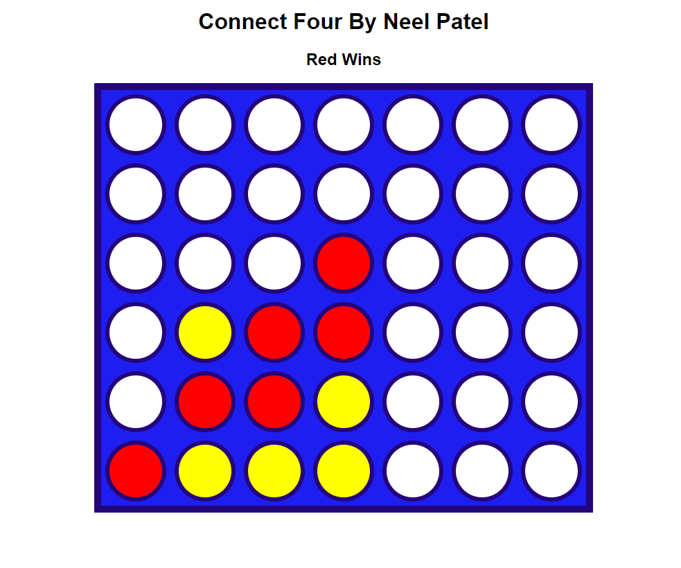

Using Live Server I wanted to make a simple Connect 4 Game

It was my first project that entangled CSS, HTML, and Javascript, so I followed a tutorial by Kenny Yip Coding called "How to Build Connect 4 with Javascript HTML CSS"
The video: https://www.youtube.com/watch?v=4ARsthVnCTg

This may be the reason why the HTML, CSS, and JS files may look similar

Click on any "tiles" in the column which will place a piece in the bottom-most position. 

Connect 4 of the same pieces to win

